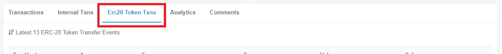

## When are liquidity mining rewards paid out?

Each weekly epoch runs begins and ends at Tuesday 12am UTC. Rewards are distributed to each participant's registered Ethereum address 3 calendar days after the end of each epoch.

## My bot is running but I'm not earning any rewards!

> **Note:** It may takes up to 1 hour for our system to start tracking newly created bots and crediting them with rewards.

Check the following if:

- You are not running Hummingbot in paper trading mode, which doesn't place real orders.
- Your bot is actually placing orders on the exchange. You should be able to see them in the exchange website. Make sure you're running token pair on our [active campaigns](https://docs.hummingbot.io/liquidity-mining/#current-campaign-terms).
- If you are running Hummingbot locally on Mac or Windows computer, your machine didn't go to sleep or lost internet connection which prevents Hummingbot from maintaining orders.

If these 3 reasons are not the cause, you can email a CSV export of your Binance order history for a particular market to accounts@hummingbot.io. Make sure to used or include the email address registered for liquidity mining.

> **Note:** We can only provide you with our system's data and cannot credit users for past rewards.

## How do I verify my payouts?

Your weekly payout email receipts contains links to the blockchain transaction confirmations. You can find these transaction confirmation links if you click on the Rewards Paid table in the Activity page.

## I don't see my earnings on my metamask and on etherscan link from my email weekly reward.

Click the etherscan link provided on email and navigate to `Erc20 Token Txns` as shown on image below, Or you may just need to add USDC token to MetaMask so you can view them. Please follow the instructions in this URL: [adding ERC20 Tokens](https://metamask.zendesk.com/hc/en-us/articles/360015489031-How-to-View-Your-Tokens)

## Do you store data that you collect with my read-only API keys?

At launch, we store individual orders and trades in order to isolate and prevent potential attempts to manipulate or abuse the system by malicious liquidity miners. After the system is more mature, we will adjust the data collection process so that we only store aggregate data and do not store individual orders and trades. We never share individual order and trade data with third parties.

## How is Hummingbot compensated for liquidity mining programs?

In return for administering liquidity mining programs, collecting the data necessary to verify the trading activity of participants, and automating the payout process, we receive compensation from our Liquidity Mining partners and customers.

## Can I earn rewards in multiple markets simultaneously?

Yes, you can run different instances of Hummingbot or your own software in order to earn rewards in multiple markets simultaneously.

## Do I need to use the Hummingbot client to participate in liquidity mining?

No; if you already have your own trading bots and strategies, you can still participate in liquidity mining by registering at [Hummingbot Miner](https://miners.hummingbot.io) and adding your exchange read-only API key.

For the general pool of users who don't have their own trading bots, we created Hummingbot as a way to provide them access to quant/algo strategies and the ability to market make.

## Get Ethereum deposit address with Metamask browser extension

1. Add Metamask extension to your favorite browser.
2. Open Metamask and create an account - complete the sign up process.
3. On Metamask dashboard make sure Network is set to Main Ethereum Network (the default network for Ether transaction is Main Net).
4. The Ethereum address is located Below Main Ethereum Network along with your name.
5. You can copy the Ethereum address by clicking your name.

Above steps are for new user, existing user can jump to step #3 after successful login.

## Get Ethereum deposit address from Binance

1. Go to [Binance](https://www.binance.com/) website.
2. Complete the sign up process.
3. Navigate to Spot wallet, click the **Deposit** button and choose **ETH** to display the Ethereum deposit address.

Above steps are for new user, existing user can jump to step #3 after successful login.

> **Note:** You may also refer to this step on [How to get your deposit address on Binance](https://academy.binance.com/tutorials/how-to-deposit#deposit).

## Get NEM deposit address

1. Go to [NEM Wallet](https://nemplatform.com/wallets/).
2. Choose the option that is supported by your OS.
3. Launch the wallet.
4. Create an account - complete the sign up process.
5. Login to your newly created wallet.
6. NEM wallet address will appear on the main screen, under Account Information.

You may also refer to this step on [how to create NEM wallet](https://youtu.be/itEcOd6ABrA).

## Get Algorand deposit address from Algorand Web Wallet

1. Go to [Algorand Web Wallet](https://myalgo.com/).
2. Create an account - complete the sign up process.
3. Make sure to save the mnemonic phrase. You need this to recover your wallet.
4. Your wallet address will appear on the main screen, below your wallet name.

## Adding Tether USDT to your Algorand wallet in Algorand Web Wallet

1. Access your Algorand wallet through [My Algo](https://myalgo.com/).
2. From your wallet dashboard, go to the drop-down menu in the top right corner.
3. Click on Add Asset.
4. Search for Tether USDt ASA #312769 . Make sure to select the one with a verified check mark.
5. Click Continue.
6. Click on Asset opt-in.
7. Input your password and click on Send to sign and broadcast your opt-in transaction to USDT.

You may also refer to this step on [adding tether USDT to algorand wallet](https://youtu.be/CDfay97RQmI).

Now you are set. Your account will now be able to receive USDT. If you want to know more about USDT please follow this [link](https://tron.network/usdt).

> **Note:** Algo require you to enable USDT. You can not use Binance deposit address because Binance does not yet support USDT ASA

> **WARNING:** CoinAlpha does not take any responsibility and will not reimburse for any loss of funds due to a participant submitting an incorrect or invalid wallet address.
