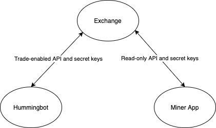

The Miner app is where you setup your liquidity mining which allows you to see real-time rates of your return(rewards) and performance, check market leaders, and track your payouts.

## How to get started

> **Prerequisites:** Two sets of API Keys are needed, trade-enabled exchange API keys for Hummingbot and read-only API keys for Miner App

1.To install Hummingbot, see [Hummingbot Quickstart Guide](https://hummingbot.io/academy/quickstart/)

> **Note:** You can use your own trading bots and strategies to participate in liquidity mining. For the general pool of users who don't have their own trading bots, Hummingbot was created to provide them access to quant/algo strategies and the ability to market make.

2. To register for Miner App, see [Liquidity Mining Quickstart Guide](https://hummingbot.io/academy/liquidity-mining/): The **official Liquidity Mining app** where you can see real-time rates of return and track your payouts
